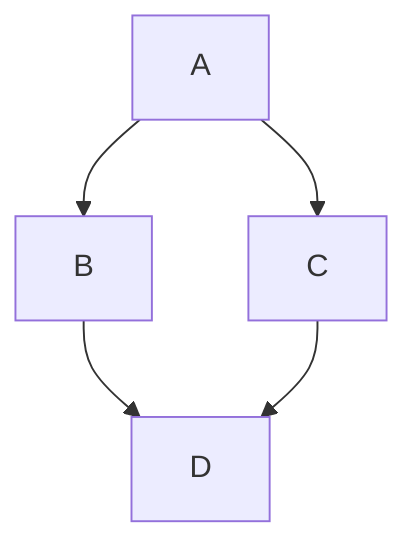

# Potential Site Changes
* clean up asides from nutshell
* check mobile experience
* professional landing page /pro?
    * resume
    * linkedin
    * write up git repos
* measure progress down the page with the length of the bookmark?
* 'flip page' animation for internal links
* keep nav menu on the left half of the book
    * swipe to the left on clicking the bookmark
* series links in the footer
* date in top corner
* align dotgrid with line spacing
* play with mermaid diagrams

