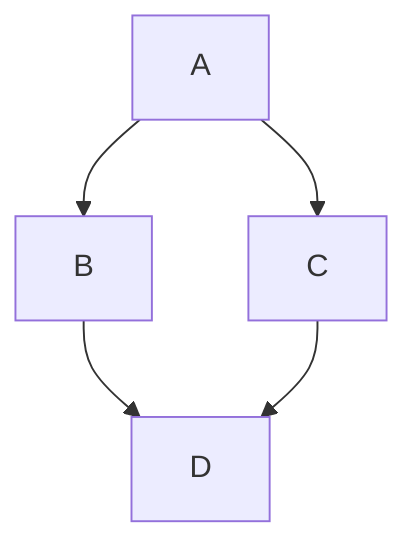

# Potential Site Changes
* clean up asides from nutshell
* professional landing page /pro?
    * resume
    * linkedin
    * write up git repos
* check mobile experience
* write up treerat's computation graphs
    * "making sense of compiler optimizations" gir.md
    * "graph-based intermediate representation"
    * accompany this with a clean up of pl.md
* write up touchstone
* todos from blog.nu
* measure progress down the page with the length of the bookmark?
* 'flip page' animation for internal links
* keep nav menu on the left half of the book
    * swipe to the left on clicking the bookmark
* series links in the footer
* align dotgrid with line spacing
* play with mermaid diagrams
* go through [inbox](inbox.md)
* publish from notebooks
* link/blog roll
* allow [comments](https://giscus.app/)?

